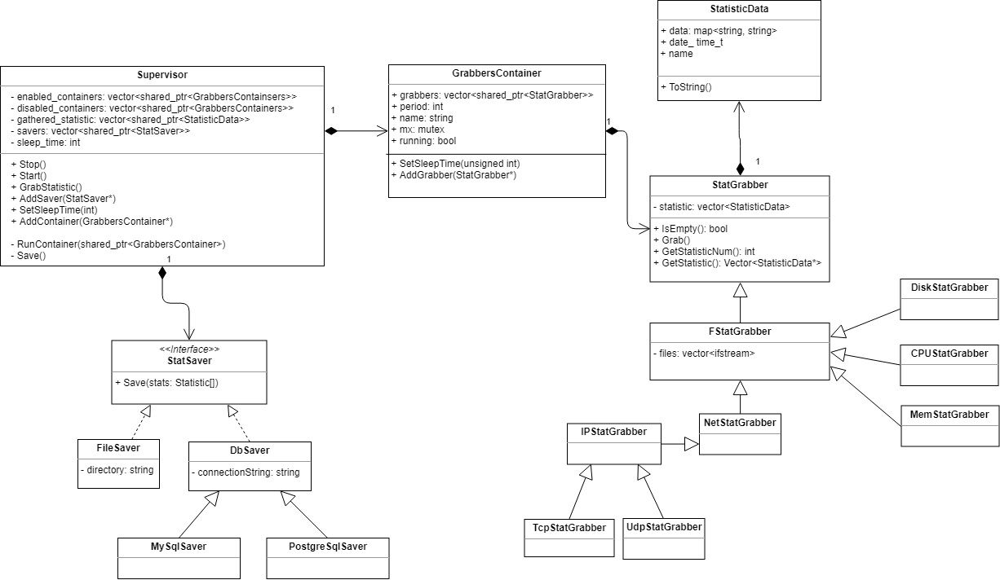

# Cистема мониторинга за сервером

    

## Описание классов

1. **FastCgiServer (класс)**: класс принимает от веб-серверов по FastCGI протоколу запросы, распарсивает их и выполняет (Получение статистики из БД, отключение StatisticGrabber’ов через методы Supervisor’a и т.д)

2. **Parser (интерфейс)**: класс, реализующий этот интерфейс должен распарсивать запросы (Класс FastCgiServer может реализовывать этот интерфейс)

3. **Authentificator (интерфейс)**: класс, реализующий этот интерфейс должен проводить аутентификацию пользователя (Класс FastCgiServer может реализовывать этот интерфейс)

4. **StatisticConverter (интерфейс)**: класс, реализующий этот интерфейс должен преобразовывать объекты класса StatisticData в определенный формат (JSON, XML и тд)

5. **SuperVisor (класс)**: класс, который следит за StatisticGrabber’ами (запускает их в отдельном потоке, забирает их накопившиеся данные, сохраняет их данные, запускает грабберы в отдельном потоке и тд)

6. **Settings (класс)**: класс, хранящий в себе настройки системы

7. **StatSaver (интерфейс)**: сохраняет стаистику. Классы, реализующие данный интерфейс должны сохранять данные, переданные им в виде объекта StatisticData

8. **StatGrabber (абстрактный класс)**: отвечает за сбор статистики (пропарсивает файлы из /proc/* в бесконечном цикле в отдельном потоке (могут и в одном потоке, все зависит от настроек) и достает из них нужную инфу), собранную статистику временно (пока ее не заберет SuperVisor) хранит в списке объектов StatisticData

9. **StatisticData (класс)**: представляет из себя собранную статистику в виде словаря строк

## Разделение проекта на части

1. Реализация АПИ, по которому клиентские приложения будут общаться с нашей системой.   
**классы**: FastCgiServer, Parser, Authentificator, StatisticConverter (в JSON и XML)

2. Реализация cохранения статистики.   
**классы**: реализации StatSaver’a, StatisticConverter (в строки)

3. Реализация сбора статистики

4. Сбор из всех классов демона
